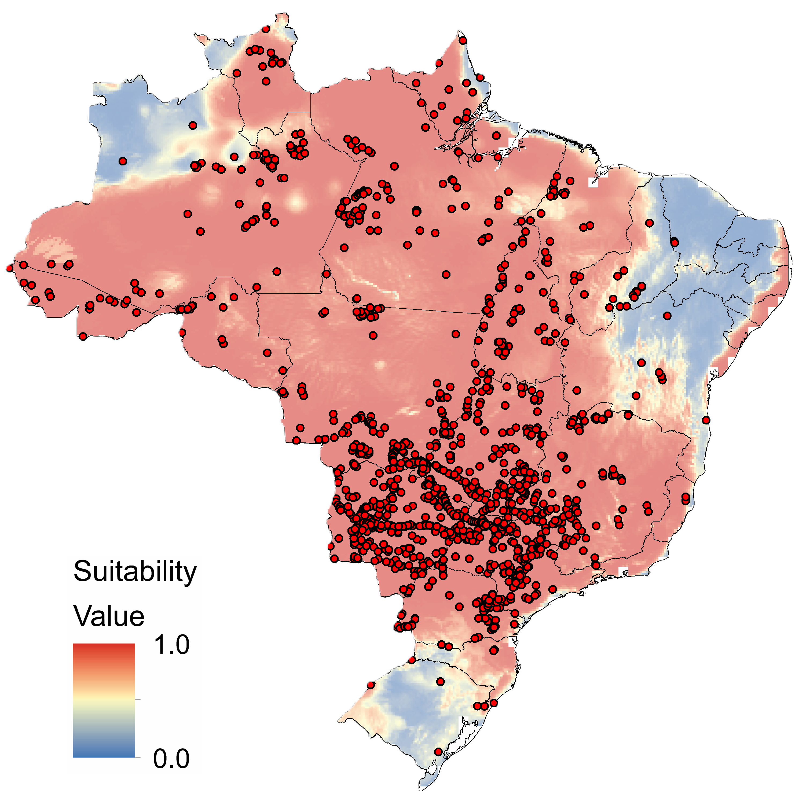

# More than points: Insights on the potential distribution areas and niche of the giant anteater 

This repository contains the script and occurrence data used in the analyses presented in the article titled "More than points: Insights on the potential distribution areas and niche of the giant anteater," currently under submission. Our goal is to expand upon the resources provided by Brazilian government agencies by developing a complementary tool to enhance their existing materials.

### This repository contains the following main files:

1 - R scripts used for ecological niche modeling and subsequent data analyses.

2 - Datasets used in the analyses, available in CSV and GeoTIFF formats.

    The scripts are based on the methods described in the article and are designed to be run sequentially.

Figure 1. The potential distribution of climate-suitable areas for the giant anteater in Brazil (*Myrmecophaga tridactyla*) and the species occurrence records used for modeling. Values closer to 1.0 indicate higher climatic suitability for the giant anteater